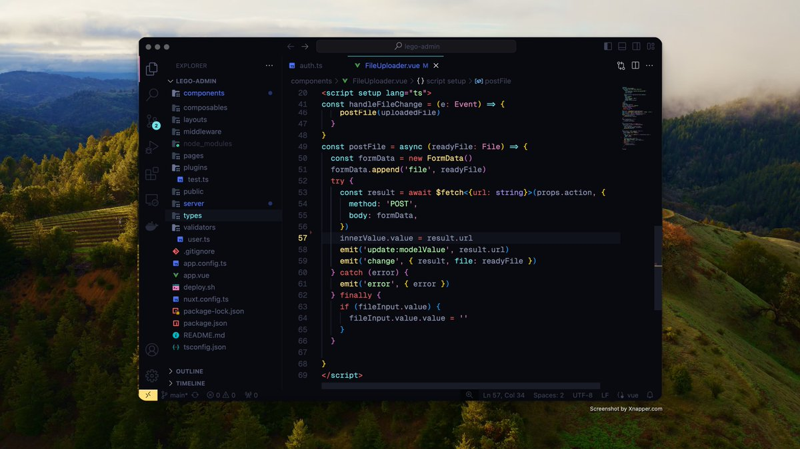

- [photor](https://www.photor.fun/editor) -- 在线美化照片神器，可做二次修改编辑
- Vscode Theme
	- 主题：**Moxer** [https://marketplace.visualstudio.com/items?itemName=Equinusocio.moxer-theme…](https://t.co/6sYlQIGCyG)
	- 图标：**Moxer Icons**
	  [https://marketplace.visualstudio.com/items?itemName=Equinusocio.moxer-icons…](https://t.co/GzFTKqgIw1)
	- 字体：**Geist Mono**
	  [https://vercel.com/font](https://t.co/zmcKaPcEqF)
	- 
-
- [OSSInsight]([https://next.ossinsight.io/widgets](https://t.co/h5jtY8aeEV)) Github Embed 组件库 [@OSSInsight](https://x.com/OSSInsight)
- ，拥有十分丰富的数据面板，可以嵌入在你的 README、项目代码中。
- 这似乎是我现在看到的最全面、组件数量最多的项目。
-
-