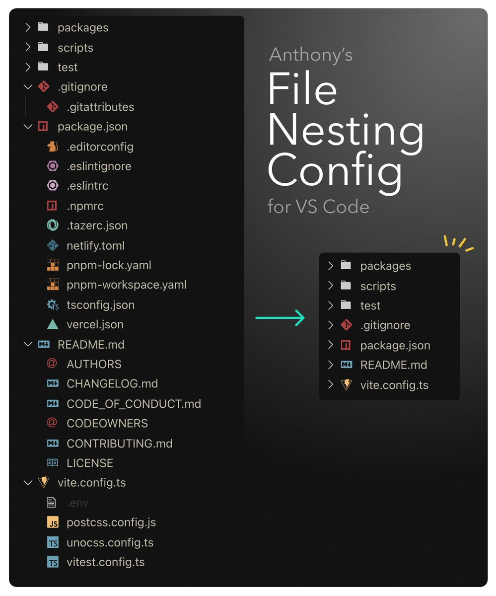

- <blockquote class="twitter-tweet">
PostgreSQL 搭配 PgAdmin 还挺好用的，不用安装桌面客户端，直接浏览器打开，方便。 <a href="https://t.co/T1HBSXSzXX">pic.twitter.com/T1HBSXSzXX</a>
&mdash; lewang🍥 (@lewangdev) <a href="https://twitter.com/lewangdev/status/1806356441651122242?ref_src=twsrc%5Etfw">June 27, 2024</a></blockquote> 
- <blockquote class="twitter-tweet">
实用教程：如何通过图片找番号？  听说狼仔通过发图找番号涨了3万粉，看着实在让人眼馋！  很多人好奇如何通过图片找番号？趁着大半夜老婆睡了，我偷偷研究了一下以图找番号的方法（郑重说明：我只是为了研究方法，并不是为了研究番号里的内容😂），那接下来让我们开始吧！… <a href="https://t.co/QJQOUSPyZk">https://t.co/QJQOUSPyZk</a> <a href="https://t.co/7cWFvSOpTS">pic.twitter.com/7cWFvSOpTS</a>
&mdash; 里奇 (@cryptolfggo) <a href="https://twitter.com/cryptolfggo/status/1806371827587104801?ref_src=twsrc%5Etfw">June 27, 2024</a></blockquote> 
- <blockquote class="twitter-tweet">
我应该称 antfu 为最伟大的程序员之一... 我今天刚了解到 VScode 的 file nesting，就看到他写的规则：<a href="https://t.co/rqWDU6aPN0">https://t.co/rqWDU6aPN0</a>  怎么说呢，看到原来一大堆平铺的文件都井井有条之后，太养眼太舒服了，建议大家赶紧用起来。配上我的 Moxer 图标库，盯着看有一种怪异满足感。 <a href="https://t.co/YnuLyK8bND">pic.twitter.com/YnuLyK8bND</a>
&mdash; Viking (@vikingmute) <a href="https://twitter.com/vikingmute/status/1806496577865003080?ref_src=twsrc%5Etfw">June 28, 2024</a></blockquote> 
  
-
-
-