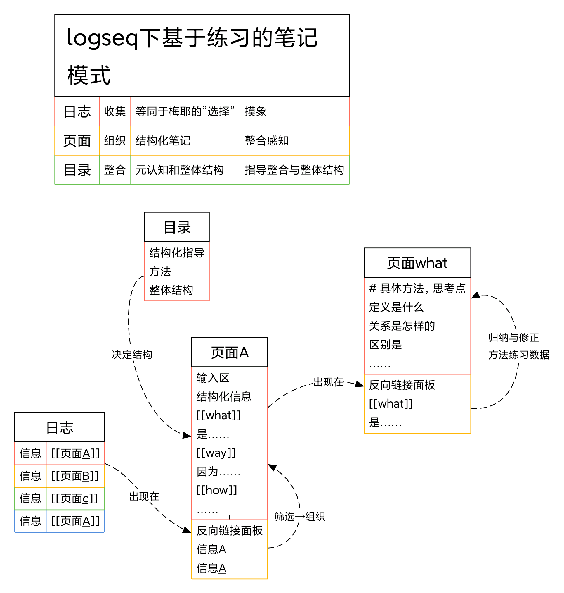

tags:: knowledge
alias:: 知识库

-
- [[Queries]]
- [[resource]]
	- https://logseq.pro/#/page/logseq  -- [[Logseq]] Pro’s Best Practice
	- https://logseq.abosen.top/#/page/README -- Abosen's Digital Garden
	-
	-
-
- Referal
  collapsed:: true
	- https://logseq.pro/#/page/queries
	- 
-
-
- ### Query Cmd
	- Query all page `tags`
	  id:: 6652dc76-3a01-4a7d-9ba6-2a46f1387ed6
	  query-properties:: [:block]
		- code
		  collapsed:: true
			- ```apl
			  #+BEGIN_QUERY
			  {:title "All page tags"
			  :query [:find ?tag-name
			      :where
			      [?tag :block/name ?tag-name]
			  ]
			   :result-transform (fn [result]
			                            (sort-by identity result))
			  :view (fn [tags]
			      [:div
			       (for [tag (flatten tags)]
			         [:a.tag.mr-1 {:href (str "#/page/" tag)}
			          (str "#" tag)])])}
			  #+END_QUERY
			  ```
		- eg
		  collapsed:: true
			- collapsed:: true
			  #+BEGIN_QUERY
			  {:title "All page tags"
			  :query [:find ?tag-name
			      :where
			      [?tag :block/name ?tag-name]
			  ]
			   :result-transform (fn [result]
			                            (sort-by identity result))
			  :view (fn [tags]
			      [:div
			       (for [tag (flatten tags)]
			         [:a.tag.mr-1 {:href (str "#/page/" tag)}
			          (str "#" tag)])])}
			  #+END_QUERY
			-
	- 查询所有包含 `logseq` 的页面和标签
		- Code
		  collapsed:: true
			- ```apl
			  #+BEGIN_QUERY
			  {:title "All page tags match regex"
			   :query [:find ?tag-name
			  	   :in $ ?match
			         :where
			         [?tag :block/name ?tag-name]
			         [(re-pattern ?match) ?regex]
			         [(re-matches ?regex ?tag-name)]
			  ]
			  :result-transform (fn [result]
			                              (sort-by identity result))
			  :view (fn [tags]
			      [:div
			       (for [tag (flatten tags)]
			         [:a.tag.mr-1 {:href (str "#/page/" tag)}
			          (str "#" tag)])])
			  :inputs [ ".*logseq.*" ]
			  }
			  #+END_QUERY
			  ```
		- eg
			- #+BEGIN_QUERY
			  {:title "All page tags match regex"
			   :query [:find ?tag-name
			  	   :in $ ?match
			         :where
			         [?tag :block/name ?tag-name]
			         [(re-pattern ?match) ?regex]
			         [(re-matches ?regex ?tag-name)]
			  ]
			  :result-transform (fn [result]
			                              (sort-by identity result))
			  :view (fn [tags]
			      [:div
			       (for [tag (flatten tags)]
			         [:a.tag.mr-1 {:href (str "#/page/" tag)}
			          (str "#" tag)])])
			  :inputs [ ".*logseq.*" ]
			  }
			  #+END_QUERY
	- 去年今日
		- code
		  collapsed:: true
			- ```apl
			  {{query (between -1y -1y )}}
			  ```
		- eg
			- {{query (between -1y - 1y )}}
			  collapsed:: true
			-
-
-
-
-
-
-